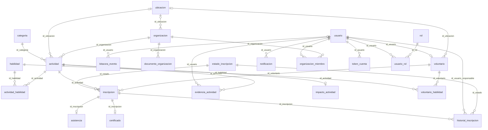

# Modelo entidad relación

```mermaid
erDiagram
    categoria ||--o{ actividad : id_categoria
    ubicacion |o--o{ actividad : id_ubicacion
    organizacion ||--o{ actividad : id_organizacion
    habilidad ||--o{ actividad_habilidad : id_habilidad
    actividad ||--o{ actividad_habilidad : id_actividad
    inscripcion ||--o| asistencia : id_inscripcion
    usuario |o--o{ bitacora_evento : id_usuario
    inscripcion ||--o| certificado : id_inscripcion
    organizacion ||--o{ documento_organizacion : id_organizacion
    usuario ||--o{ evidencia_actividad : id_usuario
    actividad ||--o{ evidencia_actividad : id_actividad
    inscripcion ||--o{ historial_inscripcion : id_inscripcion
    usuario ||--o{ historial_inscripcion : id_usuario_responsable
    estado_inscripcion ||--o{ historial_inscripcion : id_estado
    actividad ||--o| impacto_actividad : id_actividad
    estado_inscripcion ||--o{ inscripcion : id_estado
    actividad ||--o{ inscripcion : id_actividad
    voluntario ||--o{ inscripcion : id_voluntario
    usuario ||--o{ notificacion : id_usuario
    ubicacion |o--o{ organizacion : id_ubicacion
    usuario ||--o{ organizacion_miembro : id_usuario
    organizacion ||--o{ organizacion_miembro : id_organizacion
    usuario ||--o{ token_cuenta : id_usuario
    usuario ||--o{ usuario_rol : id_usuario
    rol ||--o{ usuario_rol : id_rol
    usuario ||--o| voluntario : id_usuario
    ubicacion |o--o{ voluntario : id_ubicacion
    habilidad ||--o{ voluntario_habilidad : id_habilidad
    voluntario ||--o{ voluntario_habilidad : id_voluntario
```

Cardinalidad opcional/obligatoria según nulabilidad; relaciones uno a uno según UNIQUE. Claves y atributos completos en DICCIONARIO_FISICO.md.